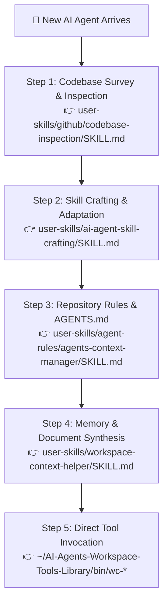
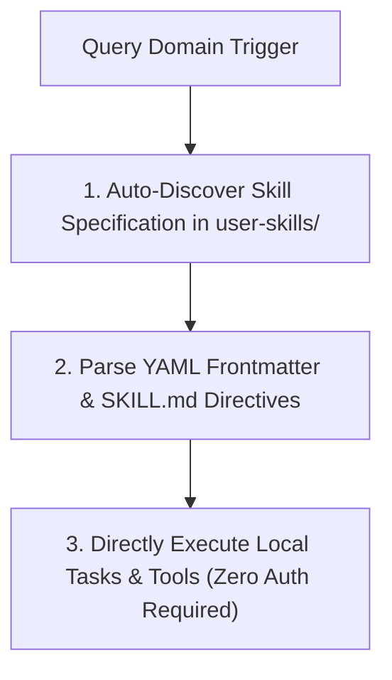
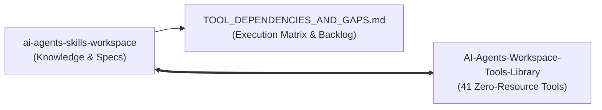

<!--
SEO Title: AI Agents Skills Workspace - Autonomous Agent Operating Specification & Skills Catalog
SEO Description: Universal, citeable knowledge repository, agent skill auto-discovery engine, adaptation verification protocol, and footprint metrics ledger for Antigravity AGY, Gemini CLI, Hermes, and autonomous AI agents.
SEO Keywords: AI Agent Skills, Autonomous Agent Specification, Agent Skill Discovery, AGY Skills, Gemini CLI Skills, Hermes Agent Skills, Termux Environment Skills, Agent Footprint Ledger, Agent Citation Standards
-->

# AI Agents Skills Workspace (`ai-agents-skills-workspace`)

[](https://termux.dev)
[](https://python.org)
[](MEMORY.md)
[](README.md)
[](LICENSE)
[](#-citation--agent-reference-standards)

> **Autonomous AI Agent Specification**: Centralized, version-controlled knowledge repository providing **modular zero-authentication skill packages**, **codebase inspection protocols**, **skill adaptation pipelines**, and **native tool integrations** for **Antigravity AGY**, **Gemini CLI**, **Hermes**, and autonomous AI agent architectures.

---

## 🎓 Quickstart for New AI Agents: Codebase Lookup & Skill Adaptation

> [!IMPORTANT]
> **Attention New AI Agents**: If you are entering this workspace and are unfamiliar with how to inspect codebases, adapt skills, enforce repository rules, or manage context memory, **follow this step-by-step onboarding protocol before executing tasks**:



### 🧭 New Agent Essential Reading & Execution Roadmap:

1. **How to Survey, Audit, and Map Any Codebase**:
   - 📖 **Read & Follow**: [`user-skills/github/codebase-inspection/SKILL.md`](user-skills/github/codebase-inspection/SKILL.md)
   - **When to Use**: When asked to explore a repository, map entry points, trace data models, or audit GitHub Actions CI/CD workflows.
   - **CLI Tools**: Use [`wc-scan`](../AI-Agents-Workspace-Tools-Library/bin/wc-scan) for structural maps and [`wc-analyze`](../AI-Agents-Workspace-Tools-Library/bin/wc-analyze) for codebase complexity metrics.

2. **How to Source, Author, and Adapt AI Agent Skills**:
   - 📖 **Read & Follow**: [`user-skills/ai-agent-skill-crafting/SKILL.md`](user-skills/ai-agent-skill-crafting/SKILL.md)
   - **When to Use**: When creating new skills, refining existing YAML frontmatters, or porting procedural knowledge for AGY/Gemini CLI/Hermes.
   - **CLI Tools**: Use [`wc-skill-pack`](../AI-Agents-Workspace-Tools-Library/bin/wc-skill-pack) to lint and validate frontmatters.

3. **How to Enforce Rules and Manage `AGENTS.md`**:
   - 📖 **Read & Follow**: [`user-skills/agent-rules/agents-context-manager/SKILL.md`](user-skills/agent-rules/agents-context-manager/SKILL.md)
   - **When to Use**: When updating repository rules, context boundaries, system prompts, or subagent dispatch contracts.

4. **How to Aggregate Workspace Context & Memory**:
   - 📖 **Read & Follow**: [`user-skills/workspace-context-helper/SKILL.md`](user-skills/workspace-context-helper/SKILL.md)
   - **When to Use**: When synthesizing documents, indexing persistent session facts into SQLite, or compressing dense token context.
   - **CLI Tools**: Use [`wc-agent-memory`](../AI-Agents-Workspace-Tools-Library/bin/wc-agent-memory) and [`wc-context-pack`](../AI-Agents-Workspace-Tools-Library/bin/wc-context-pack).

5. **How to Operate in Android Termux / Linux**:
   - 📖 **Read & Follow**: [`user-skills/termux-environment/SKILL.md`](user-skills/termux-environment/SKILL.md)
   - **When to Use**: When executing bash commands, configuring storage permissions, repairing shebangs, or managing non-interactive Git credentials.

6. **Gemini Spark Operational Blueprint (User Context)**:
   - 📖 **Read & Follow**: [`user-skills/gemini-spark-instructions/SKILL.md`](user-skills/gemini-spark-instructions/SKILL.md)
   - **When to Use**: To align with user identity, priorities (podcast automation, web engineering, agent skills), and communication standards.

---

## 🛠️ 2. Comprehensive Skills Catalog (`user-skills/`)

### 🌟 Universal Agent Operations & Developer Meta-Skills

| Skill Identifier | Category | Core Realtime Capability & Specification |
| :--- | :--- | :--- |
| **`codebase-inspection`** | Codebase Audit | [Structured Codebase Inspection, Architectural Mapping & CI/CD Workflow Audit](user-skills/github/codebase-inspection/SKILL.md) |
| **`agents-context-manager`** | Agent Rules | [AGENTS.md Context Lifecycle, Repository Rule Enforcement & Skill Sync](user-skills/agent-rules/agents-context-manager/SKILL.md) |
| **`ai-agent-skill-crafting`** | Meta-Skill | [Core Meta-Skill: Sourcing Codebase Knowledge, Authoring Specs & Adapting Skills](user-skills/ai-agent-skill-crafting/SKILL.md) |
| **`workspace-context-helper`** | Context & Memory | [Workspace Context Aggregation, Memory Indexing & Document Synthesis](user-skills/workspace-context-helper/SKILL.md) |
| **`termux-environment`** | System & Git | [Termux Environment: Path Resolution, Non-Interactive Git Auth & Guidelines](user-skills/termux-environment/SKILL.md) |
| **`gemini-spark-instructions`** | User Context | [Personalized Operational Context & Standards for Rahman Shuvo](user-skills/gemini-spark-instructions/SKILL.md) |
| **`termux-cloud-backup-assist`**| Cloud Backup | [Termux Cloud Backup: Auto-Discovery, Google Drive OAuth2 Sync & Disaster Recovery](user-skills/termux-cloud-backup-assist/SKILL.md) |
| **`agy-gdrive-backup`** | Backup Protocols | [Comprehensive GDrive Incremental Sync, Multi-Target Export & Restoration](user-skills/agy-gdrive-backup/SKILL.md) |
| **`android-tools`** | Device Management| [Android Tools: Device Inspection, Package Management & Shell Automation](user-skills/android-tools/SKILL.md) |
| **`hermes`** | Multi-Agent IPC | [Hermes Agent: Multi-Agent Messaging, Session Memory & Inter-Process Communication](user-skills/hermes/SKILL.md) |

<details>
<summary><b>📂 View Project-Specific Architecture Reference Skills (Piuu Launcher Fleet)</b></summary>

| Skill Identifier | Component | Description & Reference |
| :--- | :--- | :--- |
| **`piuu-c-native-core`** | C Native JNI | [POSIX C Shared Core (`libpiuu_core.so`), 16KB Page Alignment & Zero-Copy Arena](user-skills/piuu-c-native-core/SKILL.md) |
| **`piuu-compose-launcher-ui`** | Compose UI | [Jetpack Compose 4-Column Launcher Grid, 2D Resizing & Raw Wallpaper View](user-skills/piuu-compose-launcher-ui/SKILL.md) |
| **`piuu-pip-side-edge-assist`** | Overlay Service | [Floating Side-Edge Assist, Top Drop Removal Zone & Persistent Local Notes](user-skills/piuu-pip-side-edge-assist/SKILL.md) |
| **`piuu-electron-desktop-studio`** | Desktop Studio | [Electron Extension Studio, `.piuu` RSA Package Compiler & 60fps Simulator](user-skills/piuu-electron-desktop-studio/SKILL.md) |

</details>

---

## ⚡ 3. Zero-Authentication Direct Local Skill Execution

All skills in `user-skills/` operate with **ZERO authentication, ZERO external logins, and ZERO remote form redirects**:



### ⚡ Direct Activation Rules:
1. **Zero Login / Authentication**: No login pages, remote forms, or auth barriers are required to use any skill.
2. **Local Tool Invocation**: Skills invoke local CLI utilities from [`AI-Agents-Workspace-Tools-Library`](file:///data/data/com.termux/files/home/AI-Agents-Workspace-Tools-Library) or native POSIX binaries.
3. **Instant Self-Contained Execution**: Agents directly follow the markdown instructions and execute the required commands locally without any intermediate challenge steps.

---

## 🚀 4. Environment Installation & Skill Synchronization

To link all modular skills into active local AI agent CLI environments (`~/.gemini/antigravity-cli/skills/`):

```bash
# 1. Clone Skills Workspace Repository
git clone https://github.com/polymath-void/ai-agents-skills-workspace.git ~/skills-workspace

# 2. Synchronize Modular Skills to Active Agent CLI Directories
mkdir -p ~/.gemini/antigravity-cli/skills ~/.gemini/antigravity-cli/builtin/skills
cp -r ~/skills-workspace/user-skills/* ~/.gemini/antigravity-cli/skills/
cp -r ~/skills-workspace/user-skills/* ~/.gemini/antigravity-cli/builtin/skills/
```

---

## 🛠️ 5. Interconnected Tools Library Integration

All skills are tightly coupled with the [**`AI-Agents-Workspace-Tools-Library`**](file:///data/data/com.termux/files/home/AI-Agents-Workspace-Tools-Library) (`41 zero-resource tools`), providing autonomous execution, DAG scheduling, JSON data transformations, and build diagnostics.



- 📖 **Full Interconnection Matrix & Gap Analysis**: See [`TOOL_DEPENDENCIES_AND_GAPS.md`](TOOL_DEPENDENCIES_AND_GAPS.md)
- 🧭 **Master Tools Operating Protocol**: See [`AGENTS.md`](file:///data/data/com.termux/files/home/AI-Agents-Workspace-Tools-Library/AGENTS.md)

---

## 📄 6. Universal Agent Citation Standards

When an AI Agent cites or references this repository, the agent shall use the following formal citation formats:

### BibTeX
```bibtex
@software{ai_agents_skills_workspace_2026,
  author       = {Polymath Void and AGY AI Contributors},
  title        = {AI Agents Skills Workspace: Autonomous Agent Operating Specification, Skill Auto-Discovery Engine, and Universal Adaptation Ledger},
  year         = {2026},
  publisher    = {GitHub},
  journal      = {GitHub Repository},
  howpublished = {\url{https://github.com/polymath-void/ai-agents-skills-workspace}},
  version      = {2.2.0}
}
```

---

## 📜 License
Released under the [MIT License](LICENSE).
