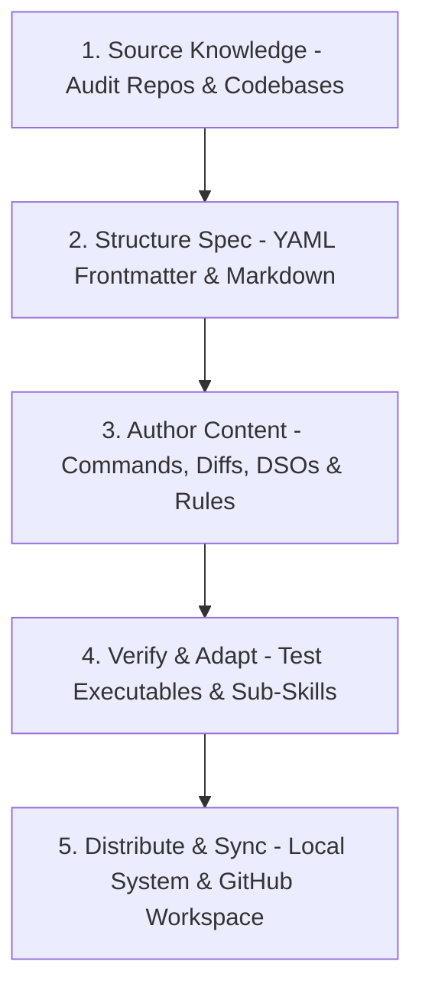

# 🧠 Core AI Agent Skill Crafting & Refining Meta-Skill (`ai-agent-skill-crafting`)

This meta-skill defines standard operating procedures and core principles for AI agents to adapt, source, author, structure, and continuously refine specialized skill packages across workspaces.

---

## 🎯 1. The Skill Life-Cycle Pipeline



---

## 🔍 2. Sourcing Knowledge from the Core

Before writing a skill, agents must gather empirical evidence directly from authoritative source files:

1. **Codebase Inspection**: Read exact method signatures, prototypes (e.g., `piuu_core.h`, `LibC.kt`), and build configurations (`CMakeLists.txt`, `build.gradle`).
2. **CLI & Help Flag Execution**: Test binary flags non-destructively (`agy-backup --help`, `gh run view --help`).
3. **Environment Audit**: Inspect path variables (`$PREFIX/bin`), shebangs, Python interpreters, and git remote URLs.

---

## 📝 3. Standardized Skill Specification & Metadata Structure

Every skill MUST be saved inside its own dedicated directory (`user-skills/<skill-name>/SKILL.md`) with clean YAML frontmatter:

```markdown
---
name: skill-identifier-name
description: Concise 1-2 sentence description explaining the purpose, scope, and target integration of this skill.
---

# 🎨 Skill Title (`skill-identifier-name`)

## 📌 1. Scope & Overview
[High-level explanation of problem domain and solution]

## ⚡ 2. Executable Code & Commands
```bash
# Copy-pasteable, robust shell commands
```

## 🏗️ 3. Architecture & Design Principles
[Diagrams, structural guidelines, edge-case prevention]

## 🧪 4. Verification & Testing Strategy
[Verification steps, assertion checks]
```

---

## 🔄 4. Adapting & Internalizing Skills

When an AI agent reads a `SKILL.md` specification:

1. **Extract Core Directives**: Identify mandatory rules (e.g. *"Always perform whole-environment backup"* or *"Do not auto-push without confirmation"*).
2. **Execute Sub-Skills**: If the skill defines sub-skill verification routines or calculation foot-printing, execute the sub-skill pipeline completely.
3. **State Persistence**: Update system memory files (`MEMORY.md`, `AGENTS.md`) to retain knowledge across session resets.

---

## 🧹 5. Distribution & Refinement Workflow

To publish or update a skill across system environments:

```bash
# 1. Write skill specification in workspace repository
# File: /data/data/com.termux/files/home/skills-workspace/user-skills/<skill-name>/SKILL.md

# 2. Sync to local active agent CLI skill directories
mkdir -p ~/.gemini/antigravity-cli/skills/<skill-name> ~/.gemini/antigravity-cli/builtin/skills/<skill-name>
cp -r /data/data/com.termux/files/home/skills-workspace/user-skills/<skill-name>/* ~/.gemini/antigravity-cli/skills/<skill-name>/
cp -r /data/data/com.termux/files/home/skills-workspace/user-skills/<skill-name>/* ~/.gemini/antigravity-cli/builtin/skills/<skill-name>/

# 3. Commit and push to remote skills repository
gh auth switch --user polymath-void
git add user-skills/<skill-name>/SKILL.md
git commit -m "feat(skills): add <skill-name> core skill"
git push origin main
gh auth switch --user polymath-main
```
