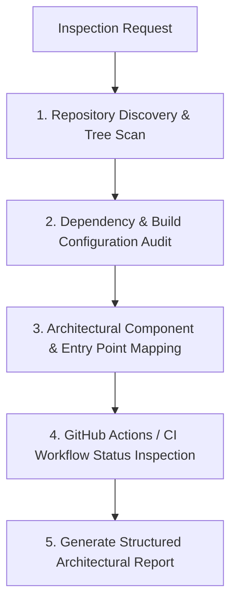

# 🔍 Codebase Inspection (`codebase-inspection`)

A structured skill for auditing, inspecting, and mapping codebase architecture, repository configurations, and build/CI workflow statuses.

---

## 🎯 When to Use
Use this skill when the user asks to:
- Inspect or audit a codebase or repository structure
- Identify key entry points, dependencies, and architectural components
- Review build configurations, scripts, or GitHub Actions CI workflows
- Analyze repo complexity, test coverage, and code hygiene
- Perform zero-loss dependency mapping and architectural telemetry

---

## 📋 Inspection Workflow Protocol

### 1. Structural Discovery & Manifest Mapping
Scan the directory layout to identify project type, primary languages, and core manifests:
- Android: `settings.gradle.kts`, `build.gradle.kts`, `AndroidManifest.xml`
- Python: `pyproject.toml`, `setup.py`, `requirements.txt`
- Node / Electron: `package.json`, `tsconfig.json`
- C / Native: `CMakeLists.txt`, `Android.mk`, `Makefile`

### 2. Dependency & Contract Verification
- Inspect module dependencies, circular references, and JNI/API contracts.
- Check third-party package counts and licensing compliance.

### 3. CI/CD & Build Health Audit
- Audit `.github/workflows/` for trigger conditions, secrets usage, matrix setups, and build targets.
- Verify branch rules, merge requirements, and automated release tags.

---

## 🛠️ Associated Workspace Tools
When performing codebase inspections, activate these tools from [`AI-Agents-Workspace-Tools-Library`](file:///data/data/com.termux/files/home/AI-Agents-Workspace-Tools-Library):

- [`wc-scan`](file:///data/data/com.termux/files/home/AI-Agents-Workspace-Tools-Library/bin/wc-scan) ([`docs`](file:///data/data/com.termux/files/home/AI-Agents-Workspace-Tools-Library/docs/tools/wc-scan.md)): Generates structured JSON directory trees and metadata maps.
- [`wc-analyze`](file:///data/data/com.termux/files/home/AI-Agents-Workspace-Tools-Library/bin/wc-analyze) ([`docs`](file:///data/data/com.termux/files/home/AI-Agents-Workspace-Tools-Library/docs/tools/wc-analyze.md)): Computes codebase cyclomatic complexity, line counts, and maintainability metrics.
- [`wc-deps`](file:///data/data/com.termux/files/home/AI-Agents-Workspace-Tools-Library/bin/wc-deps) ([`docs`](file:///data/data/com.termux/files/home/AI-Agents-Workspace-Tools-Library/docs/tools/wc-deps.md)): Maps dependency trees and detects security vulnerabilities or orphan packages.
- [`wc-contract-check`](file:///data/data/com.termux/files/home/AI-Agents-Workspace-Tools-Library/bin/wc-contract-check) ([`docs`](file:///data/data/com.termux/files/home/AI-Agents-Workspace-Tools-Library/docs/tools/wc-contract-check.md)): Audits JNI Kotlin $\leftrightarrow$ C signatures and interface parity.
- [`wc-context-pack`](file:///data/data/com.termux/files/home/AI-Agents-Workspace-Tools-Library/bin/wc-context-pack) ([`docs`](file:///data/data/com.termux/files/home/AI-Agents-Workspace-Tools-Library/docs/tools/wc-context-pack.md)): Compacts codebase inspection summaries into dense agent context payloads.
